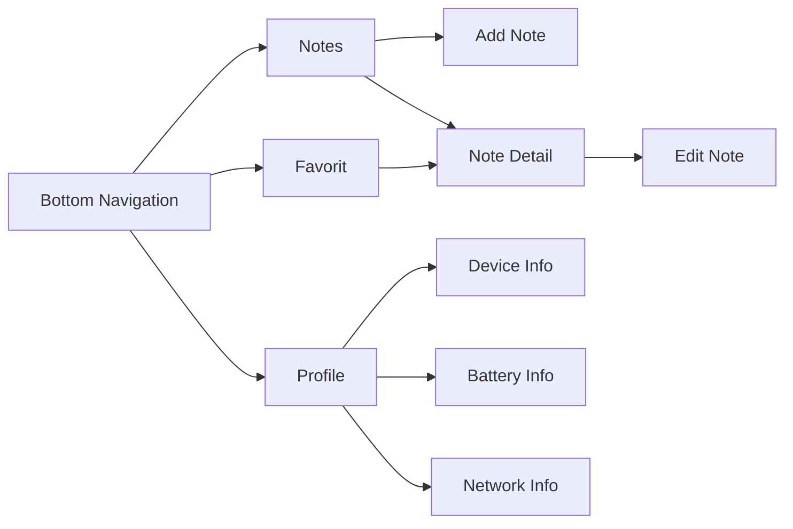
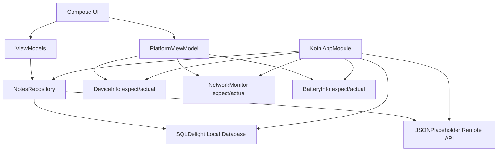

# 📱 Tugas 8 - Platform-Specific Features Notes App

<p align="center">
  
  
  
  
</p>

## 👤 Informasi Mahasiswa

| Data Diri | Keterangan |
| :--- | :--- |
| **Nama** | Awi Septian Prasetyo |
| **NIM** | 123140201 |
| **Mata Kuliah** | Pengembangan Aplikasi Mobile (PAM) |
| **Program Studi** | Teknik Informatika |
| **Institusi** | Institut Teknologi Sumatera (ITERA) |

---

## 📖 Deskripsi Proyek

Project ini merupakan aplikasi yang berisi fitur utama Notes App seperti SQLDelight, CRUD, search, favorite, settings, offline-first, dan remote sync, lalu ditingkatkan dengan fitur platform-specific menggunakan **expect/actual**, **Koin Dependency Injection**, **DeviceInfo**, **NetworkMonitor**, dan **BatteryInfo**.

Bottom navigation aplikasi:

```text
Notes | Favorit | Profile
```

Aplikasi dirancang sebagai **modern productivity notes app** dengan tampilan dashboard modern, icon-based UI, status koneksi, dan halaman Profile sebagai pusat settings serta device dashboard.

---

## 🎯 Fitur Tugas 8

### ✅ Ketentuan Utama

* **Koin Dependency Injection**  
  Dependency utama seperti database, repository, settings manager, remote API, dan platform services didaftarkan melalui Koin.

* **expect/actual Pattern**  
  Fitur platform-specific dibuat dengan deklarasi di `commonMain` dan implementasi berbeda di `androidMain`, `iosMain`, dan `jvmMain`.

* **DeviceInfo**  
  Menampilkan informasi perangkat seperti device name, OS version, platform, dan device type.

* **NetworkMonitor**  
  Menampilkan status koneksi internet di halaman Notes dan Profile.

* **Network Status Indicator**  
  Halaman Notes menampilkan indikator online/offline agar user tahu apakah remote sync tersedia.

* **Platform Info di Profile**  
  Profile berfungsi sebagai settings sekaligus device dashboard.

### 🌟 Bonus / Tambahan yang Dikerjakan

* **BatteryInfo expect/actual**  
  Menampilkan level baterai dan status charging di halaman Profile.

* **Modern UI Dashboard**  
  Notes, Favorit, dan Profile dibuat dengan tampilan modern berbasis card, chip, icon, dan dashboard summary.

* **Fitur Tugas 7 Tetap Dipertahankan**  
  SQLDelight, CRUD Notes, Search, Favorite, Settings, Offline-first, dan Remote API Sync tetap berjalan.

---

## 📱 Hasil Video & Screenshot

### 🎥 Demo Video

> **Tonton demo aplikasi di sini:**  
> https://s.itera.id/Demo-Tugas-PAM
### 📸 Screenshot Dokumentasi

| Notes Page | Favorites Page |
| :---: | :---: |
|  |  |

| Profile / Device Dashboard | Offline Network Indicator |
| :---: | :---: |
|  |  |
---

## 🧭 Alur Navigasi



---

## 🧱 Arsitektur Aplikasi



---

## 🧩 Platform-Specific Implementation

### DeviceInfo

| Source Set | Implementasi |
| :--- | :--- |
| `commonMain` | Deklarasi `expect class DeviceInfo` |
| `androidMain` | Menggunakan `Build.MODEL`, `Build.VERSION`, dan screen metrics |
| `iosMain` | Menggunakan `UIDevice` |
| `jvmMain` | Menggunakan `System.getProperty` |

### NetworkMonitor

| Source Set | Implementasi |
| :--- | :--- |
| `commonMain` | Deklarasi `expect class NetworkMonitor` |
| `androidMain` | Menggunakan `ConnectivityManager` dan `NetworkCallback` |
| `iosMain` | Stub aman agar tetap compile |
| `jvmMain` | Stub online untuk desktop |

### BatteryInfo

| Source Set | Implementasi |
| :--- | :--- |
| `commonMain` | Deklarasi `expect class BatteryInfo` |
| `androidMain` | Menggunakan `BatteryManager` dan `ACTION_BATTERY_CHANGED` |
| `iosMain` | Menggunakan `UIDevice.batteryLevel` |
| `jvmMain` | Stub `Unknown` untuk desktop |

---

## 📂 Struktur Folder Penting

```text
composeApp/src/commonMain/kotlin/org/example/project/
├── di/
│   └── AppModule.kt
├── platform/
│   ├── DeviceInfo.kt
│   ├── NetworkMonitor.kt
│   ├── BatteryInfo.kt
│   └── TimeProvider.kt
├── data/
│   ├── local/
│   ├── remote/
│   └── repository/
├── navigation/
├── ui/screens/
│   ├── NotesScreen.kt
│   ├── FavoritesScreen.kt
│   └── ProfileScreen.kt
└── viewmodel/
    ├── NotesViewModel.kt
    ├── ProfileViewModel.kt
    └── PlatformViewModel.kt
```

Platform actual files:

```text
composeApp/src/androidMain/kotlin/org/example/project/platform/
├── DeviceInfo.android.kt
├── NetworkMonitor.android.kt
├── BatteryInfo.android.kt
└── AndroidPlatformContext.kt
```

---

## 🛠️ Teknologi yang Digunakan

* Kotlin Multiplatform
* Compose Multiplatform
* Material 3
* SQLDelight
* Ktor Client
* Kotlinx Serialization
* Koin Dependency Injection
* MVVM Architecture
* Repository Pattern
* expect/actual Platform APIs
* JSONPlaceholder Remote API

---

## 🔐 Permission Android

Aplikasi menggunakan permission berikut:

```xml
<uses-permission android:name="android.permission.INTERNET" />
<uses-permission android:name="android.permission.ACCESS_NETWORK_STATE" />
```

`ACCESS_NETWORK_STATE` digunakan oleh `NetworkMonitor` untuk membaca status koneksi internet.

---

## 🧪 Demo yang Perlu Ditunjukkan

| Demo | Tujuan |
| :--- | :--- |
| Membuka halaman Notes | Menunjukkan UI utama dan local notes workspace |
| Mematikan internet | Network status indicator berubah menjadi offline |
| Menambah note saat offline | Membuktikan offline-first tetap berjalan |
| Membuka Profile | Menampilkan DeviceInfo, NetworkInfo, BatteryInfo |
| Sync pending notes | Membuktikan remote sync masih tersedia |
| Import remote notes | Mengambil sample dari JSONPlaceholder |
| Mengubah theme/sort | Menunjukkan settings tetap berjalan |

---

## ✅ Checklist Ketentuan Tugas 8

| Ketentuan | Status |
| :--- | :---: |
| Koin Dependency Injection | ✅ |
| DeviceInfo expect/actual | ✅ |
| NetworkMonitor expect/actual | ✅ |
| Device Info tampil di Profile | ✅ |
| Network Status Indicator di main screen | ✅ |
| Semua dependency utama melalui Koin | ✅ |
| BatteryInfo bonus | ✅ |
| README dokumentasi | ✅ |
| Modern icon-based UI | ✅ |

---

## ▶️ Cara Menjalankan Project

1. Buka project di Android Studio.
2. Tunggu Gradle Sync selesai.
3. Jalankan aplikasi pada emulator atau device Android.
4. Untuk menguji network indicator, matikan koneksi internet atau aktifkan airplane mode.

Build via terminal:

```powershell
.\gradlew clean
.\gradlew build --no-configuration-cache
```

---
